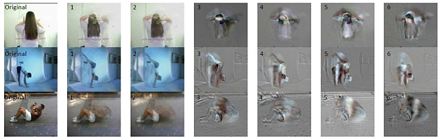

<!--
Copyright (C) 2018-2023 Mitsubishi Electric Research Laboratories (MERL)

SPDX-License-Identifier: AGPL-3.0-or-later
-->
# Discriminative Subspace Pooling Using Adversarial Perturbations (ECCV 2018)



This is the implementation of the ECCV 2018 paper Discriminative Subspace Pooling Using Adversarial Perturbations by Jue Wang and Anoop Cherian. The provided code shows how to produce the Discriminative Subspace Pooling (DSP) descriptors that are then used for video-based human action recognition -- DSP uses universal adversarial perturbations. Please see [UAP](https://arxiv.org/abs/1610.08401) for details on how to produce such perturbations/noise for video features.

## How to run the code?
Please refer to `demo_DSP.m` Matlab file to see the instructions on how to produce a DSP descriptor. As DSP descriptors are produced on a Stiefel manifold, a kernelized SVM must be used as the classifier (with e.g., RBF kernel). Please refer to [Lib-SVM](https://www.csie.ntu.edu.tw/~cjlin/libsvm/) on how to use a kernelized SVM.

# Dependencies
Requires MATLAB 2017b or later. The code uses the [ManOpt package](https://www.manopt.org/) (`GPL-3.0-or-later` license).

## Contact

Anoop Cherian: cherian@merl.com


## Citation

If you use this code, please cite the following paper:

```
@InProceedings{Wang_Cherian_2018,
author = {Wang, Jue and Cherian, Anoop},
title = {Discriminative Subspace Pooling Using Adversarial Perturbations},
booktitle = {European Conference on Computer Vision (ECCV)},
year = {2018}
}
```

## Copyright and License
Released under `AGPL-3.0-or-later` license, as found in the [LICENSE.md](LICENSE.md) file.

All files:
```
Copyright (c) 2018-2023 Mitsubishi Electric Research Laboratories (MERL)

SPDX-License-Identifier: AGPL-3.0-or-later
```
